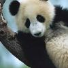
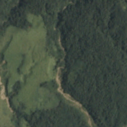
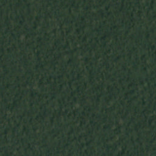

GeoTensorFlow
=======================

## Initial setup

```console
git clone https://github.com/yoninachmany/geotensorflow.git
cd geotensorflow
./inception5h/download.sh
./inception3/download.sh
```

## Test Normal Images



```console
sbt "run-main demo.LabelImageInception inception5h cropped_panda.jpg"

BEST MATCH: giant panda (95.23% likely)
```

```console
sbt "run-main demo.LabelImageInception inception3 cropped_panda.jpg"

BEST MATCH: giant panda (81.60% likely)
```

```console
sbt "run-main demo.LabelImageInception inception3-handmade cropped_panda.jpg"

BEST MATCH: n02510455 giant panda, panda, panda bear, coon bear, Ailuropoda melanoleuca (83.17% likely)
```


```console
sbt "run-main demo.LabelImageInception inception5h grace_hopper.jpg"

BEST MATCH: military uniform (28.92% likely)
```

```console
sbt "run-main demo.LabelImageInception inception3 grace_hopper.jpg"

BEST MATCH: military uniform (87.42% likely)
```

```console
sbt "run-main demo.LabelImageInception inception3-handmade grace_hopper.jpg"

BEST MATCH: n03763968 military uniform (82.85% likely)
```

## Test Satellite Images



```console
sbt "run-main demo.LabelImageInception inception5h train_1.jpg"

BEST MATCH: nematode (9.63% likely)
```

```console
sbt "run-main demo.LabelImageInception inception3 train_1.jpg"

BEST MATCH: nematode (2.16% likely)
```

```console
sbt "run-main demo.LabelImageInception inception3-handmade train_1.jpg"

BEST MATCH: n01930112 nematode, nematode worm, roundworm (2.36% likely)
```

```console
sbt "run-main demo.LabelImageRasterVision tagging/7_17_17/resnet_transform/0 train_1.jpg"
```

```
agriculture artisinal_mine bare_ground blow_down clear cloudy cultivation habitation haze partly_cloudy primary road 
MATCH: agriculture (93.61% likely)
MATCH: artisinal_mine (56.18% likely)
MATCH: bare_ground (74.19% likely)
MATCH: blow_down (53.86% likely)
MATCH: clear (82.79% likely)
MATCH: cloudy (61.66% likely)
MATCH: cultivation (46.70% likely)
MATCH: habitation (96.16% likely)
MATCH: haze (33.61% likely)
MATCH: partly_cloudy (46.89% likely)
MATCH: primary (88.13% likely)
MATCH: road (55.77% likely)
```



```console
sbt "run-main demo.LabelImageInception inception5h train_10000.jpg"

BEST MATCH: nematode (9.63% likely)
```

```console
sbt "run-main demo.LabelImageInception inception3 train_10000.jpg"

BEST MATCH: nematode (2.16% likely)
```

```console
sbt "run-main demo.LabelImageInception inception3-handmade train_10000.jpg"

BEST MATCH: n01930112 nematode, nematode worm, roundworm (2.36% likely)
```

## Run Inception v5 baseline (using provided [frozen graph](https://github.com/tensorflow/tensorflow/blob/r1.2/tensorflow/java/src/main/java/org/tensorflow/examples/LabelImage.java#L37) and [normalization stats](https://github.com/tensorflow/tensorflow/blob/r1.2/tensorflow/java/src/main/java/org/tensorflow/examples/LabelImage.java#L85-L86))

## Run Inception v3 baseline (using provided [frozen graph](https://www.tensorflow.org/tutorials/image_recognition#usage_with_the_c_api) and [normalization stats](https://github.com/tensorflow/tensorflow/blob/r1.2/tensorflow/java/src/main/java/org/tensorflow/examples/LabelImage.java#L85-L86))

### TLDR: different model, different results - but ALSO different from [expected probabilities](https://www.tensorflow.org/tutorials/image_recognition#usage_with_the_c_api)?

## Test [Keras Inception v3](https://keras.io/applications/#inceptionv3) ([making frozen graph](https://github.com/yoninachmany/geotensorflow/blob/master/inception3-homemade/Raster%2BVision%2Bmodel%2Bto%2BTensorFlow%2Bprotobuf.ipynb)) 

### TLDR: should be the same model as above, but slightly different results

### Is the Inception v3 2016_08_28 architecture the same as the Keras Inception v3 architecture?

### Are the Inception v3 2016_08_28 weights the same as the Keras Inception v3 weights?

### If yes to both, then either the Python freezing code or the Scala code is wrong

## Improve with Raster Vision

Follow the [Raster Vision](https://github.com/azavea/raster-vision) instructions to setup and run experiments locally.
