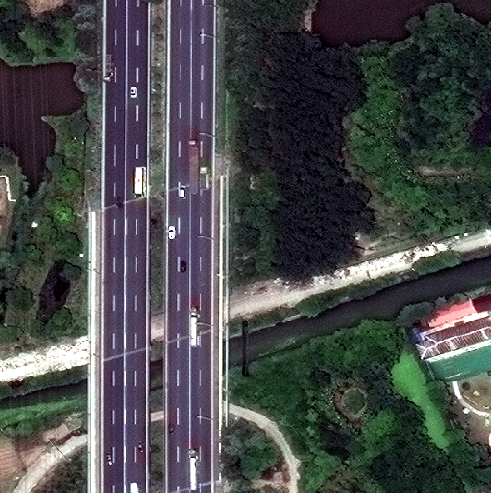

Raster Vision predictions run with GeoTrellis
=======================

## Quick Start

```console
git clone https://github.com/yoninachmany/geotensorflow.git
cd geotensorflow
(./inception5h/download.sh)
sbt "run-main demo.LabelImage inception5h spacenet.tif"
# BEST MATCH: jigsaw puzzle (54.27% likely)
```


